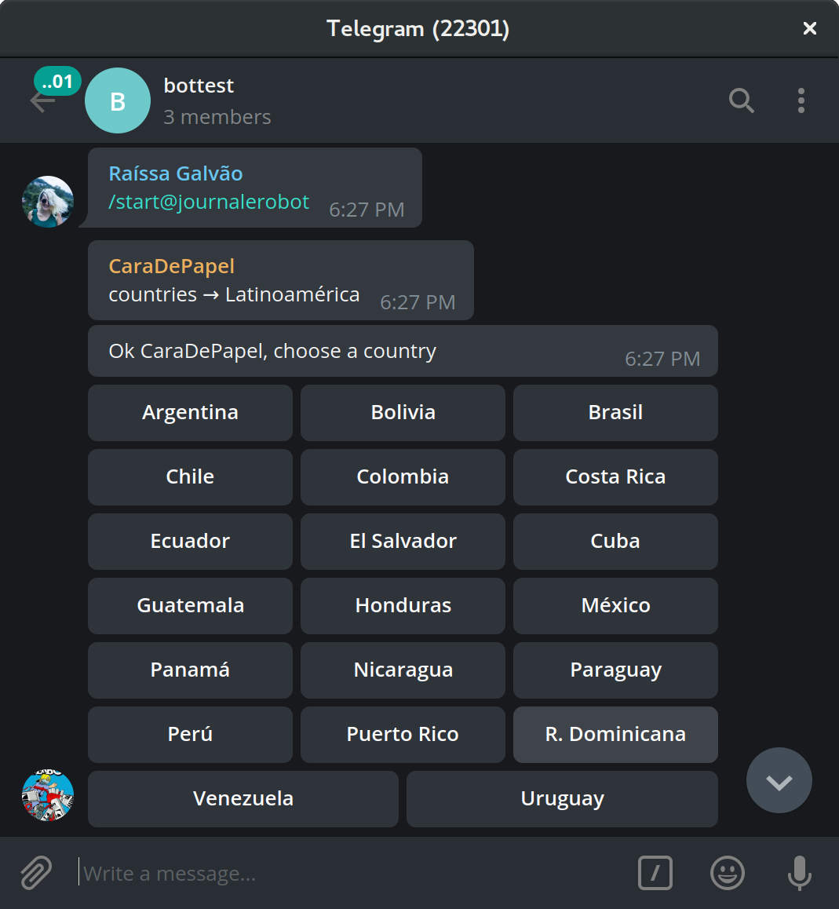

CaraDePapel: A Telegram Bot that shows you the world (via it's newspaper'scover)
==

Usage
===

to talk to this bot just add it and `/start` that's about it.
the commands are pretty straight forward: 
 - `/start` and `zones` will show you a list of world-zones (regions) you
   can see newspapers from
 - `/country ${countryName}` will list all newspapers in that country
 - `/get ${zone}/${countryName}` will send you all newspapers from a country
   neatly packed as 10 units albums
  - `/get ${zone}/${countryName}/${newspaper` will send you the cover of the
    day

Screenshots, everybody likes screenshots
====




Install
===

in order to install this you need a telegram bot API key put in ../auth.js:
```js
module.exports = {
    API_KEY: '39823092804:THE-BOTMASTER_10v3sy0u50muc4p4p4'
}
```

then you should be able to just do:
```sh
yarn && yarn build && yarn start
```

we fetch newscovers urls from various providers, check the `src/providers`
folder. the urls are cached into `zones.json`, `countries.json` and
`newspapers.json`, any changes on these files triggers a reload so if you
just run `yarn build` it will update that collection with the latest info.

it's recomended to setup a cron file like this to auto-update every 15 mins:
```sh
0  * * * * (cd ~/tapabot && sh update.sh)
15 * * * * (cd ~/tapabot && sh update.sh)
30 * * * * (cd ~/tapabot && sh update.sh)
45 * * * * (cd ~/tapabot && sh update.sh)
```

Extending
===

all tests should pass, always
to run them just invoke `yarn test`

you can add new providers to `src/providers` look at the other files for
examples and guidance.
